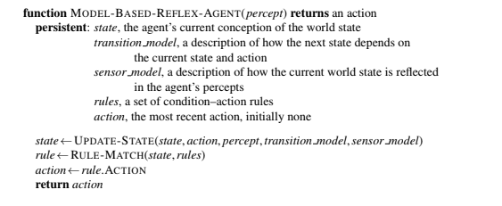

# Práctica Agentes Inteligentes

El objetivo de esta práctica es programar un agente inteligente para el entorno de tareas del juego de piedra papel tijera.

Preguntas a responder:

1. Especificar las características del entorno de trabajo.
2. Identificar el tipo de agente para determinar la estructura del agente.
3. Implementar en Python los componentes de la estructura del agente para construir la función agente o la función map.

## 1. El problema

Estudio de la solución del juego **piedra**, **papel**, **tijeras** a través de un agente inteligente programado en Python.

## 2. Esquema de tareas

El entorno de trabajo representa el contexto o escenario donde un agente inteligente realiza operaciones, interactúa y soluciona problemas específicos.

Identificar correctamente las propiedades de este entorno es fundamental, ya que contribuye al diseño más adecuado para el agente, mejorando así su desempeño y eficacia en la resolución de problemas.

Resumen de las caracteríasticas del entorno del RPS:

Contorno de tarefas | Observable| Agentes | Determinista | Episódico | Estático | Discreto | Conocido
:---: | :---: | :---: | :---: | :---: | :---: | :---: | :---: |
 RPS | Parcialmente | Multiagente | Estocástico | Episódico | Estático |  Discreto | Conocido |

- Parcialmente observable: No se puede saber qué piensa el agente rival.
- Multiagente: Existen dos jugadores (agentes) que se enfrentan.
- Estocástico: Las acciones del agente varían el resultado en cada partida.
- Episódico: Cada partida es "independiente" de la anterior.
- Estático: El medio no cambia mientras el usuario piensa su acción.
- Discreto: Las variables a tener en cuenta son limitadas y discretas.
- Conocido: Sabemos las reglas del juego en todo momento y no cambian.

## 3. Estructura del agente

Una vez se conoce en profundidad el entorno de trabajo del agente, es posible definir con mayor precisión la estructura que este tomará. En este caso se ha optado por utilizar un programa de agente inteligente basado en modelos.

Este tipo de agentes consideran el historial de partidas y, por lo tanto, pueden actuar en un escenario que no se observa por completo, como es en este caso con el RPS, teniendo así una visión más completa del mismo.

## 4. Implementación

Para la implementación del agente, se registra el resultado de cada partida en un archivo JSON con el siguiente formato:

        {
            "player": "Paper",
            "computer": "Paper",
            "result": "Tie"
        }

Cuando el historial.json está vacío, o el número de partidas es menor a 3, la elección de "computer" se elige de manera aleatoria, ya que no se cuenta con un conjunto de datos suficiente para hacer una elección informada.

Posteriormente, utilizando la información almacenada en el historial, se realiza un análisis de la frecuencia de cada elección por parte del "player". Se selecciona la opción con la frecuencia más alta y se elige la opción que la venza. Por ejemplo, si la elección con mayor frecuencia (en ese momento) es "tijera", la próxima elección de "computer" será "piedra".

Mediante este método, se extrae información del conjunto de datos de partidas con el objetivo de determinar la elección con mayor probabilidad de victoria para "computer".

Este agente está implementado en Python 3.10.12 y utiliza la librería Pandas. El código fue aportado por el usuario [@dfleta](https://github.com/dfleta) y modificado para acatar las necesidades de este proyecto por [@cuernomax2](https://github.com/cuernomax2) y por mí. El código se encuentra en [mi repositorio de Git](https://github.com/jesus-fv/piedra-papel-tijeras)

## 5. Bibliografía

Lutz, Mark. Learning Python. Sebastopol, Ca, O’reilly, 2018.

Martin, Robert C. Clean Code a Handbook of Agile Software Craftmanship. Upper Saddle River [Etc.] Prentice Hall, 2010.

Martin, Robert C. Clean Architecture: A Craftsman’s Guide to Software Structure and Design. Prentice Hall, 2018.

S. McConnel. Code Complete: A Practical Handbook of Software Construction, 2dn Edition. Microsoft Press, 2004.

Russell, Peter. ARTIFICIAL INTELLIGENCE : A Modern Approach, Global Edition. S.L., Pearson Education Limited, 2021.