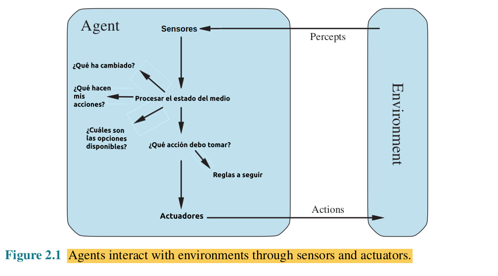
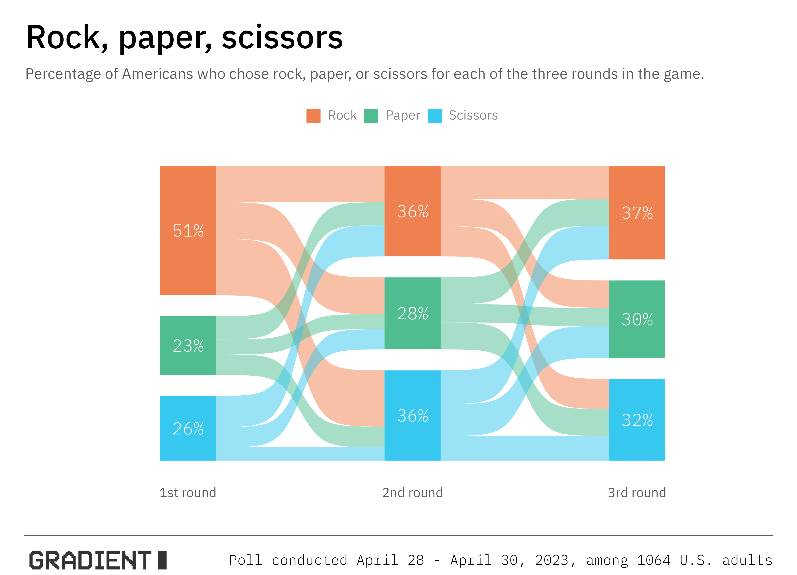
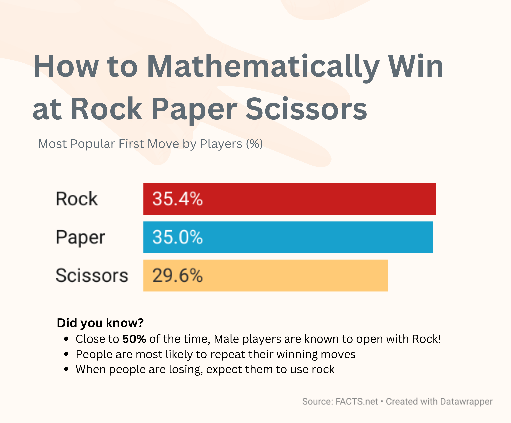

# Práctica Agentes Inteligentes

El objetivo de esta práctica es programar un agente inteligente para el entorno de tareas del juego de piedra papel tijera.

Preguntas a responder:

1. Especificar las características del entorno de trabajo.
2. Identificar el tipo de agente para determinar la estructura del agente.
3. Implementar en Python los componentes de la estructura del agente para construir la función agente o la función map.

## 1. Esquema de tareas

El entorno de trabajo representa el contexto o escenario donde un agente inteligente realiza operaciones, interactúa y soluciona problemas específicos.

Identificar correctamente las propiedades de este entorno es fundamental, ya que contribuye al diseño más adecuado para el agente, mejorando así su desempeño y eficacia en la resolución de problemas.

Resumen de las caracteríasticas del entorno del RPS:

Contorno de tarefas | Observable| Agentes | Determinista | Episódico | Estático | Discreto | Conocido
:---: | :---: | :---: | :---: | :---: | :---: | :---: | :---: |
 RPS | Parcialmente | Multiagente | Estocástico | Episódico | Estático |  Discreto | Conocido |

- Parcialmente observable: No se puede saber qué piensa el agente rival.
- Multiagente: Existen dos jugadores (agentes) que se enfrentan.
- Estocástico: Las acciones del agente varían el resultado en cada partida.
- Episódico: Cada partida es "independiente" de la anterior.
- Estático: El medio no cambia mientras el usuario piensa su acción.
- Discreto: Las variables a tener en cuenta son limitadas y discretas.
- Conocido: Sabemos las reglas del juego en todo momento y no cambian.

## 2. Estructura del agente

Una vez se conoce en profundidad el entorno de trabajo del agente, es posible definir con mayor precisión la estructura que este tomará. En este caso se ha optado por utilizar un programa de agente inteligente basado en modelos.

El agente utiliza una estadística para las tres primeras rondas  sobre los movimientos más utilizados por los americanos (véanse las imágenes adjuntas). De este modo se intenta predecir cuál será el primer movimiento del rival y jugar en base a ese resultado, intentando siempre ganar.

